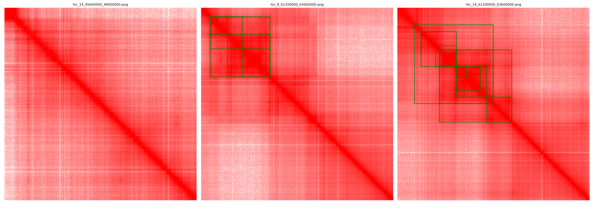

# ViTTAD: Transformer-Based Detection of Topologically Associating Domains from Hi-C Contact Maps

ViTTAD formulates TAD (Topologically Associating Domain) identification as an object
detection problem: Hi-C contact matrices are rendered as images, TADs appear as
triangular blocks along the main diagonal, and a [DINO](https://github.com/IDEA-Research/DINO)
(DETR with Improved DeNoising Anchor Boxes) detector is trained to localize them as
bounding boxes. Detected boxes are mapped back to genomic coordinates to obtain TAD calls.

<div align="center">
  
  <p><em>Example TAD annotations rendered on a Hi-C contact map.</em></p>
</div>

## Repository Structure

```
vittad/
├── main.py                  # Training entry point
├── pre.py                   # Evaluation / inference entry point
├── engine.py                # Train / eval loops
├── configs/
│   ├── DINO/
│   │   ├── DINO_4scale.py       # Base 4-scale DINO config
│   │   ├── custom_dino.py       # TAD training config (single class)
│   │   └── ...                  # Swin / ConvNeXt / 5-scale variants
│   └── tad.py                # H5-based TAD dataset config variant
├── datasets/
│   ├── tad/                  # COCO-style TAD dataset (images + annotations)
│   └── dataset.py            # H5 Hi-C matrix dataset (HiCTADDataset)
├── models/
│   └── dino/                 # DINO detector (backbone, transformer, ops)
├── util/                     # Logging, boxes, config, visualization utilities
├── tools/
│   ├── yolo2coco.py          # Convert YOLO-style TAD labels to COCO format
│   ├── fix_annotation_ext.py # Normalize image extensions in COCO json
│   └── benchmark.py          # Inference speed benchmark
├── scripts/                  # Convenience train / eval scripts
└── requirements.txt
```

## Installation

1. Create an environment and install PyTorch (CUDA build matching your driver):

```bash
conda create -n vittad python=3.9 -y
conda activate vittad
pip install torch torchvision  # pick the CUDA build for your system
pip install -r requirements.txt
```

2. Compile the multi-scale deformable attention CUDA operator (required by DINO):

```bash
cd models/dino/ops
python setup.py build install
python test.py  # all checks should print True
cd ../../..
```

## Data Preparation

The detector consumes contact-map images plus COCO-format TAD annotations:

```
data/tad/
├── images/                  # Contact-map tiles rendered as PNG images
└── annotations/
    └── annotations.json     # COCO-format boxes, one category: "tad"
```

- Render your Hi-C matrices (e.g. from `.hic` / `.cool` at a fixed resolution) into
  square image tiles along the diagonal. Each TAD, spanning genomic interval
  `[start, end]`, becomes the box that covers its triangle:
  `[x_start, y_start, x_end, y_end]` in pixel coordinates.
- If your labels are in YOLO text format, convert them with
  `python tools/yolo2coco.py` (set `VITTAD_DATA_ROOT` to your data directory).
- `datasets/dataset.py` additionally provides `HiCTADDataset`, which reads matrices
  directly from an HDF5 file with a CSV of TAD pixel coordinates
  (see `configs/tad.py`).

### Backbone weights

`configs/DINO/custom_dino.py` uses a `convnext_xlarge_22k` backbone by default and
expects the ImageNet-22k pretrained weights under `models/weights/`. Download them
from the [official ConvNeXt release](https://github.com/facebookresearch/ConvNeXt)
(or switch `backbone` to `resnet50`, which downloads automatically via torchvision).

## Training

```bash
python main.py \
  --config_file configs/DINO/custom_dino.py \
  --dataset_file tad \
  --coco_path data/tad \
  --output_dir outputs/tad
```

Checkpoints, logs, and the fully resolved config are written to `--output_dir`.
Multi-GPU training works through the standard `torch.distributed.launch` /
`torchrun` interface, and `run_with_submitit.py` supports SLURM clusters.

## Evaluation and Inference

```bash
python pre.py \
  --config_file configs/DINO/custom_dino.py \
  --dataset_file tad \
  --coco_path data/tad \
  --resume outputs/tad/checkpoint.pth \
  --eval \
  --visualization_dir outputs/tad/visualizations
```

- `--eval` reports COCO-style detection metrics (AP / AR) on the validation split.
- `--visualization_dir` saves side-by-side images of ground-truth and predicted TADs.
- Predicted boxes are exported with scores so they can be mapped back to genomic
  coordinates (pixel index x resolution) for downstream analysis.

## Acknowledgments

This codebase is built upon [DINO](https://github.com/IDEA-Research/DINO)
(IDEA Research) and inherits components from
[DETR](https://github.com/facebookresearch/detr) and
[Deformable DETR](https://github.com/fundamentalvision/Deformable-DETR).
We thank the authors for releasing their code.

## License

This project is released under the [Apache 2.0 license](LICENSE), consistent with
the upstream DINO codebase.

## Citation

If you find this repository useful, please consider citing:

```bibtex
@misc{vittad,
  title  = {ViTTAD: Transformer-Based Detection of Topologically Associating Domains from Hi-C Contact Maps},
  author = {ViTTAD contributors},
  year   = {2026},
  url    = {https://github.com/K999458/vittad}
}
```
